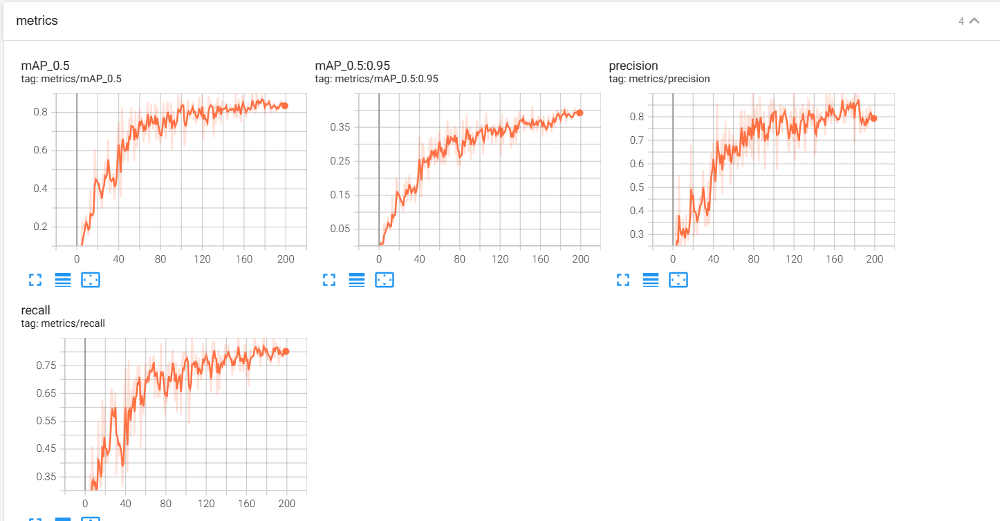
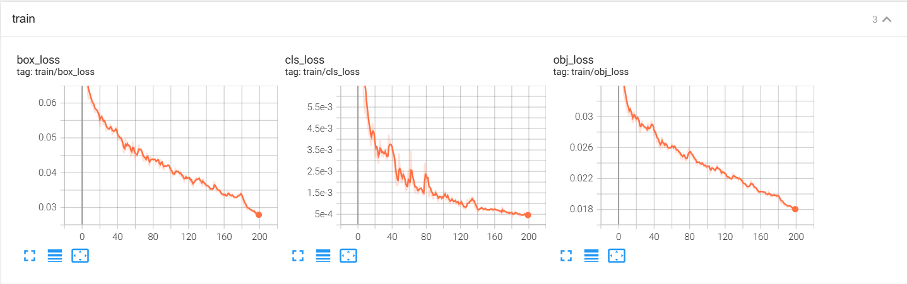
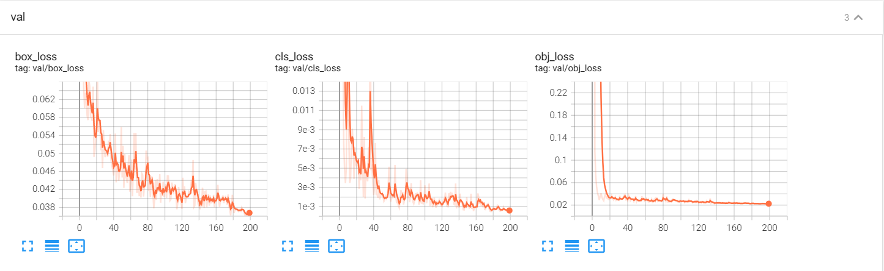
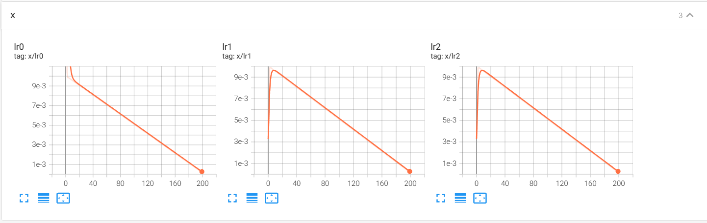
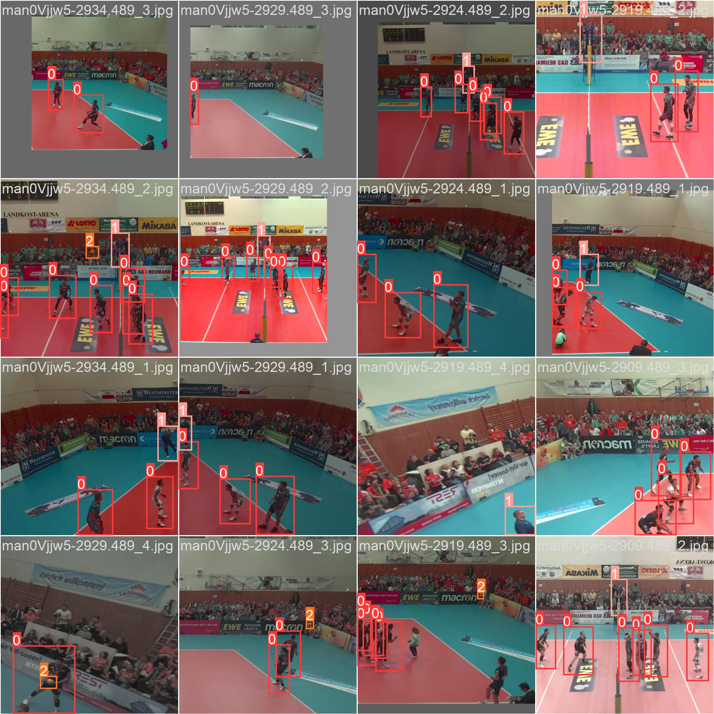
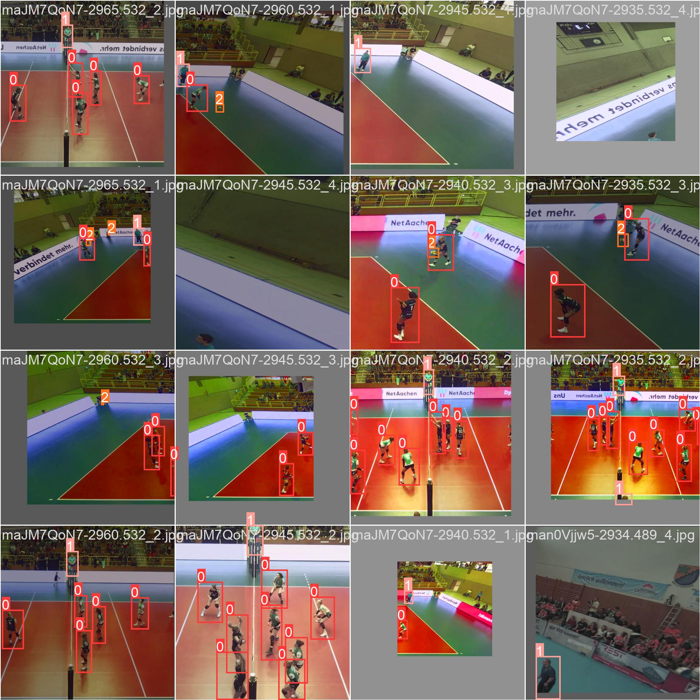
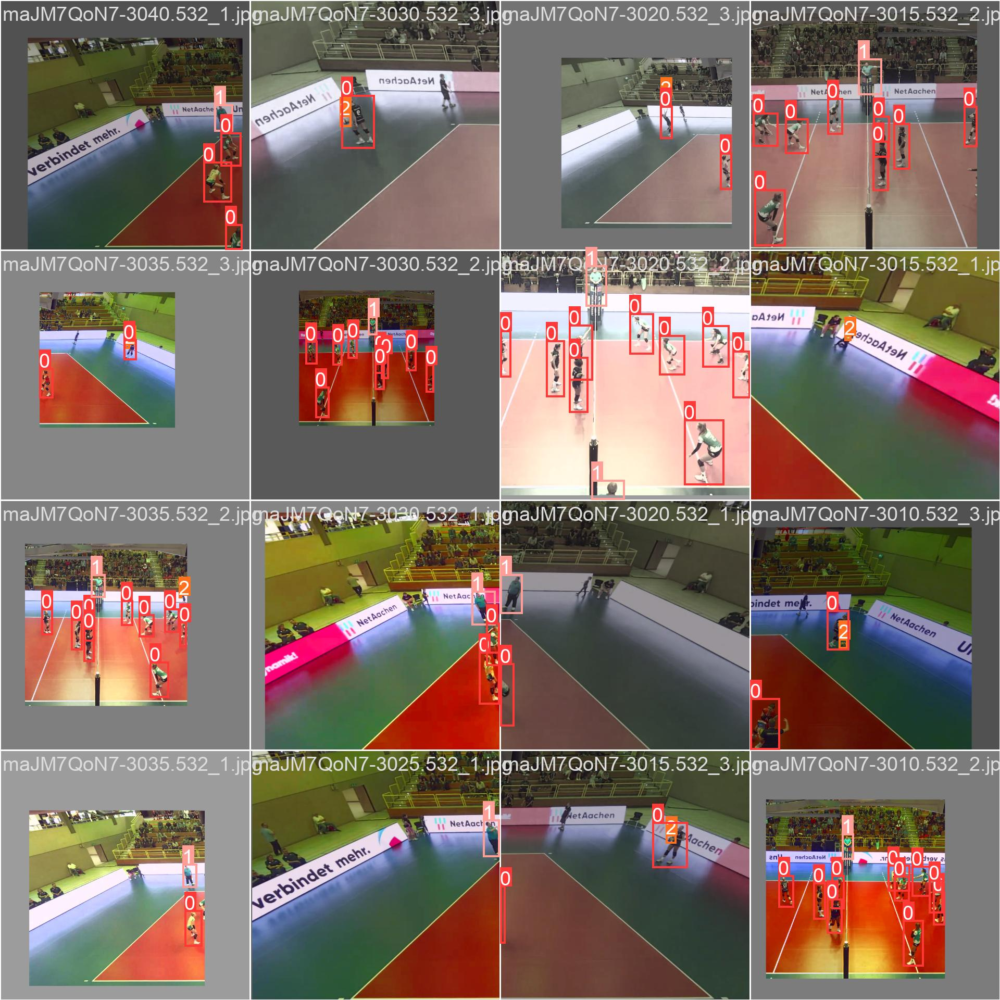
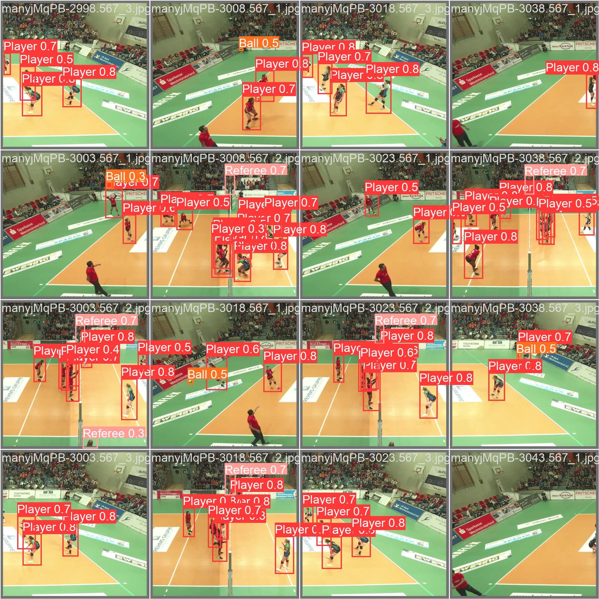
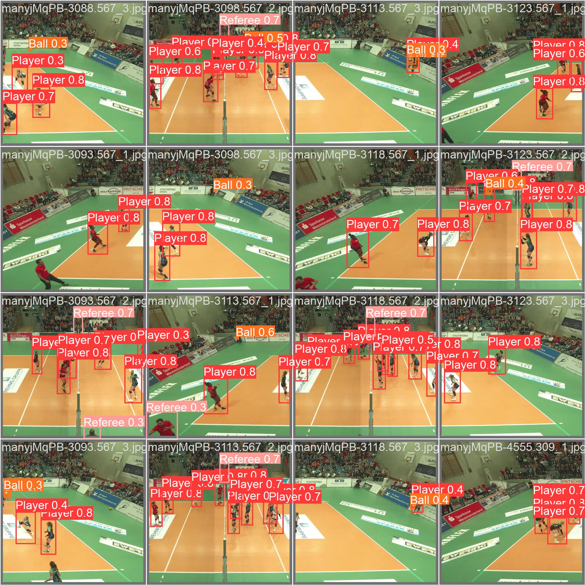

# Yolov5_volleyball

A YOLOv5-based project for detecting volleyballs in images and videos. This project is designed to accurately identify and track the ball during gameplay for analysis or automation purposes.


<div align="center">*video demo*</div>

## Tensorboard

<div align="center">*metrics.png*</div>  


<div align="center">*train.png*</div>


<div align="center">*val.png*</div>


<div align="center">*x.png*</div>

## Train batch




<div align="center">*train_batch*</div>




<div align="center">*val_batch*</div>


## Features and Functionality

*   **Volleyball Detection:** Utilizes the YOLOv5 object detection model to identify volleyballs in images and videos.
*   **Dataset Formatting:** Includes a script (`volleyball_format_dataset.py`) to preprocess and format a volleyball dataset into the YOLOv5-compatible format. This script handles splitting the dataset into training and validation sets and organizing the images and labels into the required directory structure.
*   **Training and Validation:** Supports training and validation of the YOLOv5 model on the formatted volleyball dataset.
*   **Inference:** Enables the use of a trained YOLOv5 model to perform real-time volleyball detection in videos or images.

## Technology Stack

*   **Python:** Primary programming language.
*   **YOLOv5:** Object detection framework.
*   **PyTorch:** Deep learning framework used by YOLOv5.
*   **OpenCV (cv2):** Image and video processing library.
*   **os:** Python module for interacting with the operating system.
*   **shutil:** Python module for high-level file operations.

## Prerequisites

Before you begin, ensure you have the following installed:

*   **Python:** (Version 3.7 or higher recommended)
*   **PyTorch:** Follow the installation instructions on the [PyTorch website](https://pytorch.org/get-started/locally/) based on your system configuration.  For example: `pip install torch torchvision torchaudio`
*   **CUDA Toolkit (if using GPU):**  Install the appropriate CUDA Toolkit version compatible with your GPU.
*   **YOLOv5 Dependencies:** Install the required Python packages by navigating to your YOLOv5 directory and running: `pip install -r requirements.txt` (Typically found in the original YOLOv5 repository which you'll need to clone or download initially).
*   **Other Python Packages:** `opencv-python` (install using `pip install opencv-python`)

## Installation Instructions

1.  **Clone the Repository:**

    ```bash
    git clone https://github.com/vanhdev-web/Yolov5_volleyball
    cd Yolov5_volleyball
    ```

2.  **Download YOLOv5:** This repository contains the data formatting script, but you will also need to download or clone the official YOLOv5 repository from Ultralytics.

    ```bash
    git clone https://github.com/ultralytics/yolov5
    cd yolov5
    pip install -r requirements.txt
    cd ..
    ```

3.  **Prepare your Dataset:**
    * Ensure your volleyball dataset is structured with images and corresponding text files containing bounding box annotations in the format expected by the `volleyball_format_dataset.py` script (one text file per image). The text files should contain normalized bounding box coordinates and class label.
    * The directory structure expected by `volleyball_format_dataset.py` is :

    ```
    volleyball/
        volleyball/
            image1.jpg
            image1.txt
            image2.jpg
            image2.txt
            ...
    ```

4.  **Format the Dataset:**

    Run the `volleyball_format_dataset.py` script to format your dataset into the YOLOv5-compatible structure.  This will create a new directory named `volleyball_yolo` with the appropriate subdirectories for training and validation images and labels.

    ```bash
    python volleyball_format_dataset.py
    ```

    This script will create the following directory structure:

    ```
    volleyball_yolo/
        images/
            train/
                image1.jpg
                image2.jpg
                ...
            val/
                imageN.jpg
                imageN+1.jpg
                ...
        labels/
            train/
                image1.txt
                image2.txt
                ...
            val/
                imageN.txt
                imageN+1.txt
                ...
    ```

## Usage Guide

1.  **Configure YOLOv5:**

    *   Create a YAML file (e.g., `volleyball.yaml`) in the `yolov5/data/` directory (or any location you prefer, as long as you specify the path correctly during training) that defines the paths to your training and validation datasets and the number of classes.  A basic example would look like this:

    ```yaml
    train: ../Yolov5_volleyball/volleyball_yolo/images/train  # train images
    val: ../Yolov5_volleyball/volleyball_yolo/images/val  # val images

    nc: 1  # number of classes
    names: ['volleyball']  # class names
    ```

    *   Modify the model configuration file (e.g., `yolov5s.yaml`) in the `yolov5/models/` directory to reflect the number of classes in your dataset. Specifically, change the `nc` (number of classes) value. However, it's generally recommended to copy the original `yolov5s.yaml` to a new file (e.g., `yolov5s_volleyball.yaml`) and modify that file to avoid overwriting the original YOLOv5 configuration.  The relevant section to modify looks like this (example from `yolov5s.yaml`):

    ```yaml
    # Parameters
    nc: 80  # number of classes
    depth_multiple: 0.33  # model depth multiple
    width_multiple: 0.50  # layer channel multiple
    anchors:
      - [10,13, 16,30, 33,23]  # P3/8
      - [30,61, 62,45, 59,119]  # P4/16
      - [116,90, 156,198, 373,326]  # P5/32
    ```
    Change `nc: 80` to `nc: 1` since you are only detecting one class (volleyball).

2.  **Train the Model:**

    Navigate to the `yolov5` directory and train the YOLOv5 model using the following command, adjusting the paths to your data configuration file and model configuration file accordingly:

    ```bash
    cd yolov5
    python format_dataset.py --img 640 --batch 16 --epochs 30 --data ../Yolov5_volleyball/volleyball.yaml --cfg models/yolov5s_volleyball.yaml --weights yolov5s.pt
    ```

    *   `--img`: Image size for training.
    *   `--batch`: Batch size.
    *   `--epochs`: Number of training epochs.
    *   `--data`: Path to your data configuration file (`volleyball.yaml`).
    *   `--cfg`: Path to your modified model configuration file (`yolov5s_volleyball.yaml`).
    *   `--weights`: Pre-trained weights to use for transfer learning (e.g., `yolov5s.pt`).

3.  **Run Inference:**

    After training, you can use the trained model to detect volleyballs in images or videos.  Use the `detect.py` script in the `yolov5` directory:

    ```bash
    python detect.py --weights runs/train/exp/weights/best.pt --img 640 --conf 0.5 --source 0
    ```

    *   `--weights`: Path to the trained weights file (`best.pt`).  The `exp` directory name increments with each training run (e.g., `exp2`, `exp3`).
    *   `--img`: Image size for inference.
    *   `--conf`: Confidence threshold (adjust as needed).
    *   `--source`: Source of the input (e.g., `0` for webcam, path to an image file, or path to a video file).

## API Documentation

This project primarily focuses on object detection using YOLOv5 and does not include a separate API. The YOLOv5 repository provides its own API, which you can explore for advanced usage and integration options.  Refer to the official YOLOv5 documentation for details.

## Contributing Guidelines

Contributions to this project are welcome! To contribute:

1.  Fork the repository.
2.  Create a new branch for your feature or bug fix.
3.  Make your changes and commit them with clear, descriptive messages.
4.  Submit a pull request to the `main` branch.

## License Information

License information is not specified in the initial repository. Please add appropriate license details. If no license is explicitly added, all rights are reserved by the owner. Consider adding an open-source license like Apache 2.0 or MIT license.

## Contact/Support Information

For questions or support, please contact [vanhdev-web](https://github.com/vanhdev-web) via GitHub.